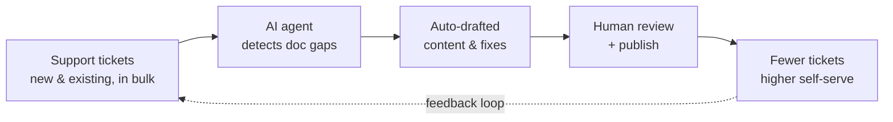

# Sabuj Bandopadhyay
### Documentation Problem-Solver & Builder — Docs-as-Code · AI-Powered Documentation · Developer Experience

> 🌐 **Prefer an interactive view?** This portfolio is also a live, interactive site →
> **[sabuj000.github.io/Portfolio](https://sabuj000.github.io/Portfolio/)**

---

## 👋 Introduction

Hi, I’m Sabuj — a **Product Documentation Manager** with 10+ years in technical writing, API
documentation, and knowledge management, and **3+ years leading documentation** for APIs, SDKs,
integrations, and developer platforms.

I’ve grown from Technical Writer to Senior Technical Writer to Documentation Manager, and today I
run product documentation as a product in its own right: setting content strategy, operating a
docs-as-code platform, partnering with Product and Engineering on every release, and using AI and
automation to scale output and reduce support cost — without scaling headcount.

I design documentation that's easy to find and accessible, maintain compliance with ISO standards and
document-control processes, and build AI-ready content. My work sits at the intersection of
**Documentation, Product, Engineering, Go-to-Market, Support, Marketing, Data, and Developer
Experience**, turning complex systems into clear, dependable content that helps both human developers
and AI assistants succeed.

At my core I’m a **problem-solver** — equally comfortable driving the work hands-on as a **lead
individual contributor** or guiding a **team**. I care more about the challenge and the learning than
the title, and I’m open to roles on either track that bring hard problems worth solving.

**Core focus:** Problem-Solving · Content Strategy · Docs-as-Code · AI & Automation · Technical Writing ·
Data-Informed Decisions

---

## 📈 Impact Highlights

I don’t measure documentation by page counts — I measure it by the business problems it solves.
Each initiative below is framed as **problem → what I built → ROI**.

| 🎯 Problem | 🔧 What I built | 📈 ROI |
|---|---|---|
| Reactive doc fixes let support tickets pile up (high L1 cost) | AI agents analyzing new & existing support tickets in bulk to detect & fix gaps | **Lower ticket volume & support cost** — reactive → proactive |
| Docs team bottlenecked engineering velocity | A docs CLI (OpenAPI gen, scaffolding, sync, validation, preview) | **79% of API doc PRs now authored by engineers**; contributors ~2× — no added headcount |
| Manual drafting capped team throughput | Multiple AI skills that draft & update feature docs from any source (Notion, Google Docs, PDF, Jira…) | **Publishing time cut >50%** — faster contribution & easier collaboration |
| Text-only docs slow onboarding & evaluation | A sustained pipeline publishing 30+ videos/month | **Faster feature adoption & self-serve onboarding**; stronger prospect evaluation |
| Fragmented KB hurt findability, drove support load | Migrated 1,800+ articles, standardized (95% style compliance) | **Engagement +12%, page views 2× (58K+), copy-fix requests −45%** |
| Manual release notes (~8 hrs) + recurring broken links | Release-notes automation with API docs as single source of truth | **~8 hrs → ~15 min**; broken-link gap permanently closed |
| Review bottleneck slowed launches | PM-as-first-drafter publishing model | **Documentation SLA ~50% lower** |

<b>📂 Expand the detail behind each number</b>

 

- **~2× growth in documentation footprint** — scaled the content library to ~4,800 files (up from
  ~2,400), while raising quality and consistency.
- **79% of API documentation contributions now come from non-docs engineers** — up over 110%
  quarter-over-quarter, with the contributor base nearly doubling — by building self-serve tooling
  that removed the docs team as a bottleneck.
- **Publishing time cut by more than 50%** using AI assistants built into the documentation workflow.
- **Documentation SLA reduced by ~50%** through a PM-as-first-drafter model (128 PRs raised, 68 published).
- **Support load measurably reduced** — copy-fix/edit requests on user docs down 45% in two quarters,
  with engagement up 12% and page views more than doubled after a large knowledge-base migration.
- **Release-notes effort cut from ~8 hours to ~15 minutes** through automation and single-source-of-truth
  changelogs.
- **30+ how-to videos published every month** on a sustained pipeline, continuously scaling self-serve learning.

---

## 🔭 Vision — Where I’m Taking Documentation Next

A builder’s view of the problems coming for every docs org, and the bets I’m making to get ahead of them:

- **🧩 Docs as the backbone of AI** — AI assistants are becoming how developers consume docs. I structure
  content to be AI-ready and LLM-friendly, so one source serves people, search, and in-product AI assistants.
- **📡 Signal-driven, proactive docs** — documentation that fixes itself: tickets, search queries, and usage
  signals feeding autonomous agents that close gaps before they generate support cost.
- **💹 Docs that prove their ROI** — connecting content to fewer support tickets, feature adoption, and sales
  pipeline, so documentation is a measurable growth driver, not a cost center.

---

## 🧭 How I Work

I run documentation as a product — strategy, governance, and engineering rigor applied to content.
The **measurable outcomes** of everything below live in [Impact Highlights](#-impact-highlights);
here’s the *approach* behind them.

- **Docs-as-code & tooling** — manage content in Git / Markdown / MDX with PR reviews, CI checks, and
  previews; build CLIs and automation (OpenAPI generation, scaffolding, validation) so engineers can
  contribute and release notes/changelogs stay accurate from a single source of truth.
- **AI & automation** — build AI agents and skills into the documentation lifecycle: ticket-driven
  agents that proactively close gaps, and skills that draft/update docs from any source (Notion, Google
  Docs, PDF, Jira). I also structure content to be AI-ready and LLM-friendly for in-product assistants.
- **Strategy & governance** — own site structure and findability; maintain a defined style standard,
  ISO standards, and document control; run continuous audits of older docs so people, LLMs, and
  MCP-based tools stay accurate during onboarding.
- **Data-informed** — a single analytics dashboard (Looker Studio) over GA4, Pendo, FullStory, and
  Splunk, plus analysis of how AI bots and LLMs read the docs — feeding insights back into the roadmap.
- **Adoption & revenue** — in-app banners that move users from docs into demos and sign-ups, and
  analytics connected to the CRM so documentation ties to measurable sales pipeline.
- **Visual & video** — diagrams (Mermaid) and design collaboration (Figma), plus a sustained video
  pipeline (watch examples in [Documentation Artifacts](#-documentation-artifacts-live-at-chargebee)).
- **Scaling through contribution** — a PM-as-first-drafter model and contributor/buddy programs
  (60+ articles) that grow output without growing headcount; when contributions get rejected, I fix the
  root cause to lift quality and cut review time.
- **Cross-functional by default** — partner across Leadership, Product, Go-to-Market, Marketing,
  Support, Engineering, Design, and Developer Experience to keep docs in sync with launches and the
  go-to-market plan.

**How the AI documentation loop works:**

---

## 🧠 My Developer-Experience Perspective

I approach developer experience as a **journey problem**, not a documentation problem.

When working on developer-facing products, I focus on:

- Helping developers reach their first success quickly and experiment safely
- APIs that are clear, predictable, and easy to recover from when something goes wrong
- Complete, end-to-end workflows rather than isolated features
- Practical examples, edge cases, and what to do when things fail
- Content that works for people, SDKs, and AI tools alike

I regularly review APIs, SDKs, and docs from a developer’s point of view and give feedback on naming,
inputs/outputs, error handling, and overall usability.

---

## 🧑‍🤝‍🧑 Leadership & Influence

Whether steering a team or an initiative, I bring the same problem-solving rigor, visibility, and
ownership. These qualities apply whether I'm leading people or leading the work itself.

- **Walk the talk — a player-coach who writes** — I don't just manage; I personally own features and
  products end-to-end as the writer (user, API, and any content the feature demands), staying close to
  the craft and credible with my team.
- **Decisions grounded in data** — I base direction on data, not opinion — using it to define and
  conclude my and my team's action items, prioritize effort, and prove whether the work moved the needle.
- **Make team performance visible** — track contribution and documentation performance every month,
  comparing month-over-month and quarter-over-quarter trends to decide concrete action items for the
  next cycle — proving impact with numbers, not assertions.
- **Communicate up, consistently** — send structured weekly updates covering initiative status,
  contributor-level data, blockers, and next steps, making the team's work legible to leadership.
- **Delegate ownership, not just tasks** — assign end-to-end ownership of major initiatives to
  individual team members and credit them by name to leadership, building their visibility and growth.
- **Coach before the moment, not after** — proactively prep team members with structured talking
  points before key meetings, developing their presence and confidence.
- **Set direction proactively** — drive the documentation roadmap and cross-functional alignment
  rather than waiting to be directed.
- **Protect the team from bad bets and pivot fast** — diagnose the root cause, document what *is*
  working, and propose a better workflow instead of pushing harder on a failing path.
- **Define growth paths for the team** — established five growth axes for my reports: analytics &
  strategy, AI & automation, technical enablement, documentation architecture, and mentorship.
- **Advocate for the team's tools and conditions** — escalate real workflow friction to IT and tooling
  leadership with a clear business case, advocating for working conditions, not just output.
- **Fix problems at the root** — when contributions get rejected, I investigate why and fix the real
  cause (unclear guidelines, process gaps) so fewer get rejected and less effort is wasted on rework.

---

## 🏢 Professional Background

**Chargebee** — 2021–Present *(grew from individual contributor to people manager)*
- **Documentation Manager** (Apr 2023 – Present) — own documentation strategy, docs-as-code,
  API & SDK docs, and AI-assisted documentation and tooling; lead and grow the docs team.
- **Senior Technical Writer** (Jan 2022 – Apr 2023) — led the team, delegated ownership, and
  reviewed performance, with data-driven decision making.
- **Technical Writer** (Aug 2021 – Dec 2021) — API documentation and OpenAPI implementation for
  subscription and payments products.

**Earlier experience**
- **Capillary Technologies** — Technical Writer (Aug 2020 – Aug 2021): user guides, release notes,
  and UI content review; API documentation (payload/parameter descriptions using Markdown, Postman,
  OpenAPI); data-driven content with UML (use-case, sequence, activity diagrams); and video content
  (online product training courses and YouTube channel management) for retail CRM, ecommerce &
  loyalty platforms.
- **Netradyne** — Technical Writer (Apr 2019 – Jul 2020): product guides, how-tos, installation
  manuals, online help, FAQs, and internal/customer-facing release notes for an intelligent driving
  monitoring system and device; UI content and narrated video content.
- **Alternative Minds** — Technical Writer (May 2017 – Apr 2019): instruction manuals, content
  management, online help, and release notes; gathered and disseminated technical information across
  customers, designers, and developers.
- **FreeBalance** — QA Tester (Sep 2014 – Apr 2017): documentation and content management for
  government public-financial-management portals (user guides, product descriptions, FAQs) and
  system-specification testing against to-be documentation.

*Earlier roles in marketing and market research (2012–2014) built a foundation in content writing,
research, and client communication.*

---

## 🎓 Education

- **Master of Computer Applications (MCA), Information Technology** — West Bengal University of
  Technology, Kolkata (2009–2012)
- **Bachelor of Computer Application (BCA), Information Technology** — West Bengal University of
  Technology, Kolkata (2006–2009)

---

## 📚 Documentation Artifacts (live at Chargebee)

The full spectrum of documentation my team and I ship — each linked to the live, published version:

| Artifact | Link |
|---|---|
| 📘 User Docs | https://www.chargebee.com/docs |
| 💬 KB Articles & FAQ | https://www.chargebee.com/docs/billing/2.0/subscriptions/articles-and-faq |
| 🧩 Use-case Docs | https://www.chargebee.com/docs/billing/2.0/usage-based-billing/usage-based-billing-usecases |
| 🔌 API Docs | https://apidocs.chargebee.com/docs/api |
| 🛠️ Implementation Tutorials | https://www.chargebee.com/tutorials/ |
| 🗂️ Data Catalog | https://datacatalog.chargebee.com/ |
| 🤝 Partner SPI Docs | https://spidocs.chargebee.com/api-reference/partner-spi/overview |
| 🎛️ Frontend Capabilities (Chargebee.js) | https://www.chargebee.com/checkout-portal-docs/ |
| 🆕 Release Notes | https://release-notes.chargebee.com/ |
| 📝 API Changelog | https://www.chargebee.com/help/api-updates/ |
| 🎬 Video walkthroughs (Trainn) | A sustained pipeline of 30+ how-to & concept videos a month |

### Selected samples & writing

- **SDK docs:** [iOS](https://github.com/chargebee/chargebee-ios/blob/master/README.md) ·
  [Android](https://github.com/chargebee/chargebee-android/blob/master/README.md)
- **Tutorials I authored:** [Subscription enrollment](https://www.chargebee.com/tutorials/subscription-enrollment/#pdp-widget-creation) ·
  [Razorpay JS integration](https://www.chargebee.com/tutorials/razorpay-js-integration-with-chargebee-api/)
- **Reference:** [API error-handling docs](https://apidocs.chargebee.com/docs/api/errors?lang=curl)
- **Writing:** [Building an MDX-enabled documentation platform](https://www.linkedin.com/pulse/build-your-own-mdx-enabled-product-documentation-sabuj-bandopadhyay-p11nc/) ·
  [Docs-as-Code and Developer Experience](https://www.linkedin.com/feed/update/urn:li:activity:7289904367044816897/) ·
  [Documentation in the Age of AI](https://www.linkedin.com/feed/update/urn:li:activity:7342773027962527744/)

---

## 💻 Tools & Stack

**Documentation & docs-as-code**
- Markdown, MDX, reusable components
- Git, GitHub workflows, CI/CD, content previews
- OpenAPI / API reference tooling, documentation CLIs and automation

**AI & automation**
- Prompt engineering, custom GPTs, and AI skills for the documentation lifecycle
- AI agents for ticket-driven content improvement
- AI tools: Claude, GPT, Cursor
- AI-ready content structuring for in-product assistants

**Code & API tooling**
- HTML, CSS, JavaScript (ES6+), TypeScript (working knowledge)
- JSON, XML
- OpenAPI, Postman, curl

**Analytics & visualization**
- GA4, Pendo, FullStory, Looker Studio, Splunk
- AI/LLM-crawl analytics — measuring how AI bots and LLMs read documentation

**Visual & media**
- Mermaid, Figma, Camtasia, Trainn, SnagIt

**Standards & process**
- ISO standards, document control, knowledge management, accessibility

---

## 🚀 Current Focus Areas

- AI-powered, ticket-driven documentation that proactively closes content gaps
- Scaling docs-as-code and contributor pipelines without growing headcount
- Connecting documentation to adoption, self-serve success, and revenue
- Data-informed approaches to continuously improving documentation and DX

---

## 📫 Contact

- LinkedIn: https://in.linkedin.com/in/sabujbandopadhyay
- Email: sbtechwriter@gmail.com

---

*I enjoy working on developer-first platforms where documentation, tooling, data, and AI come together
to create a cohesive experience.*
