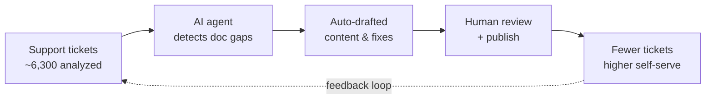
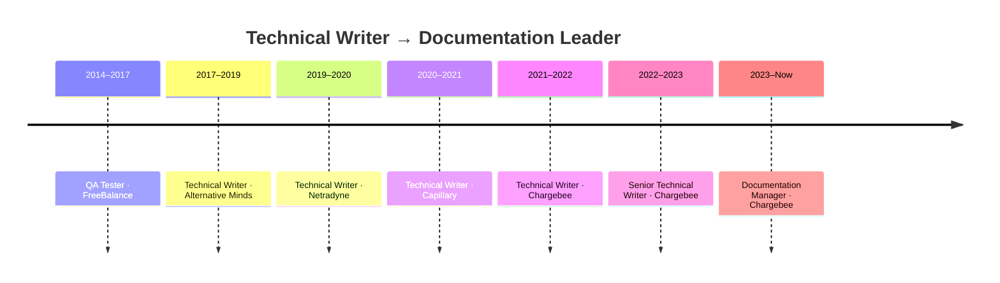

# Sabuj Bandopadhyay
### Product Documentation Manager — Team Leadership · Docs-as-Code · AI-Powered Documentation · Developer Experience

> 🌐 **Prefer an interactive view?** This portfolio is also a live, interactive site →
> **[sabuj000.github.io/Portfolio](https://sabuj000.github.io/Portfolio/)**

---

## 👋 Introduction

Hi, I’m Sabuj — a **Product Documentation Manager** with 10+ years in technical writing, API
documentation, and knowledge management, and **3+ years leading documentation** for APIs, SDKs,
integrations, and developer platforms.

I’ve grown from Technical Writer to Senior Technical Writer to Documentation Manager, and today I
run product documentation as a product in its own right: setting content strategy, operating a
docs-as-code platform, partnering with Product and Engineering on every release, and using AI and
automation to scale output and reduce support cost — without scaling headcount.

I design accessible documentation systems for information retrieval, maintain compliance with ISO
standards and document-control processes, and build AI-ready content. My work sits at the
intersection of **Documentation, Product, Engineering, Data, and Developer Experience**, turning
complex systems into clear, dependable content that helps both human developers and AI assistants
succeed.

**Core focus:** Content Strategy · Documentation Management · Technical Writing · Editing ·
User Experience Writing

---

## 📈 Impact Highlights

A snapshot of outcomes I’ve driven as a documentation leader:

I don’t measure documentation by page counts — I measure it by the business problems it solves.
Each initiative below is framed as **problem → what I built → ROI**.

| 🎯 Problem | 🔧 What I built | 📈 ROI |
|---|---|---|
| Reactive doc fixes let support tickets pile up (high L1 cost) | AI agents analyzing ~6,300 support tickets to detect & fix gaps | **Lower ticket volume & support cost** — reactive → proactive |
| Docs team bottlenecked engineering velocity | A docs CLI (OpenAPI gen, scaffolding, sync, validation, preview) | **79% of API doc PRs now authored by engineers**; contributors ~2× — no added headcount |
| Manual drafting capped team throughput | 5+ GPTs / AI skills across the documentation lifecycle | **Publishing time cut >50%** — more output per person |
| Text-only docs slow onboarding & evaluation | 30+ how-to & concept videos on a repeatable pipeline | **Faster feature adoption & self-serve onboarding**; stronger prospect evaluation |
| Fragmented KB hurt findability, drove support load | Migrated 1,800+ articles, standardized (95% style compliance) | **Engagement +12%, page views 2× (58K+), copy-fix requests −45%** |
| Manual release notes (~8 hrs) + recurring broken links | Release-notes automation with API docs as single source of truth | **~8 hrs → ~15 min**; broken-link gap permanently closed |
| Review bottleneck slowed launches | PM-as-first-drafter publishing model | **Documentation SLA ~50% lower** |

<b>📂 Expand the detail behind each number</b>

 

- **~2× growth in documentation footprint** — scaled the content library to ~4,800 files (up from
  ~2,400), while raising quality and consistency.
- **79% of API documentation contributions now come from non-docs engineers** — up over 110%
  quarter-over-quarter, with the contributor base nearly doubling — by building self-serve tooling
  that removed the docs team as a bottleneck.
- **Publishing time cut by more than 50%** using AI assistants built into the documentation workflow.
- **Documentation SLA reduced by ~50%** through a PM-as-first-drafter publishing model.
- **Support load measurably reduced** — copy-fix/edit requests on user docs down 45% in two quarters,
  with engagement up 12% and page views more than doubled after a large knowledge-base migration.
- **Release-notes effort cut from ~8 hours to ~15 minutes** through automation and single-source-of-truth
  changelogs.
- **30+ how-to videos shipped** on a repeatable weekly pipeline, scaling self-serve learning.

---

## 🔭 Vision — Where I’m Taking Documentation Next

A builder’s view of the problems coming for every docs org, and the bets I’m making to get ahead of them:

- **🧩 Docs as the backbone of AI** — AI assistants are becoming how developers consume docs. I structure
  content to be LLM-ready and retrieval-grade, so one source powers humans, search, and in-product copilots.
- **📡 Signal-driven, proactive docs** — documentation that fixes itself: tickets, search queries, and usage
  signals feeding autonomous agents that close gaps before they generate support cost.
- **💹 Docs that prove their ROI** — connecting content to support deflection, feature adoption, and pipeline,
  so documentation is a measurable growth lever, not a cost center.

---

## 🔁 How AI-Driven Documentation Works

A core part of my work: shifting documentation from reactive to proactive using support signals.

---

## 🛤️ Career Journey

---

## 🗓️ What I Do Day-to-Day

- **Own the documentation roadmap** — plan and prioritize alongside product releases, balancing
  new-feature coverage, debt reduction, and quality.
- **Partner on every release** — review specs early and ship docs, changelogs, and migration guides
  *with* the feature, not after it.
- **Operate docs-as-code** — manage content in Git/Markdown/MDX with review workflows, CI checks,
  and previews.
- **Lead with AI and automation** — build AI assistants and automation into the documentation
  lifecycle to multiply output.
- **Enable contributors** — make it easy for PMs, engineers, and support to contribute through
  tooling, templates, and review.
- **Measure and improve** — track how developers actually use docs and feed insights back into the roadmap.
- **Connect docs to business outcomes** — tie documentation to support deflection, adoption, and
  pipeline activation.

---

## 🧑‍🤝‍🧑 Leadership & Team Management

I lead with visibility, data, and ownership — and build those same qualities into my team.

- **Communicate up, consistently** — send structured weekly updates to leadership covering
  initiative status, contributor-level data, blockers, and next steps, making the team's work
  legible to leadership without being asked.
- **Delegate ownership, not just tasks** — assign end-to-end ownership of major initiatives to
  individual team members and credit them by name to leadership, building their visibility and growth.
- **Coach before the moment, not after** — proactively prep team members with structured talking
  points before key meetings, developing their presence and confidence.
- **Make team performance visible with data** — tracked contribution trends over 17 months to prove
  impact with numbers (e.g., engineer contributors growing 16 → 28 and PRs up 111% quarter-over-quarter),
  rather than asserting it.
- **Protect the team from bad bets and pivot fast** — when an approach isn't working, I diagnose the
  root cause, document what *is* working, and propose a better workflow to leadership instead of
  pushing harder on a failing path.
- **Set direction and align cross-functionally** — proactively drive the documentation roadmap in
  partnership with DevEx, Product, PMM, and Engineering rather than waiting to be directed.
- **Define growth paths for the team** — established five professional-growth axes for my reports:
  analytics & strategy, AI & automation, technical enablement, documentation architecture, and
  mentorship — building a team, not just managing headcount.
- **Advocate for the team's tools and conditions** — escalate real workflow friction to IT and tooling
  leadership with a clear business case, advocating for my team's working conditions, not just output.
- **Apply engineering-level rigor** — run formal root-cause analyses (e.g., on rejected contributions)
  to fix upstream quality issues and reduce wasted effort, not just track the numbers.
- **Keep a distributed team in sync** — share clear weekly updates separating business-as-usual from
  major initiatives, with linked context for every workstream, creating a transparent, psychologically
  safe team culture.

---

## 🤖 AI-Powered Documentation

A core part of my work is using AI to shift documentation from reactive to proactive and to multiply
team output.

- **Ticket-driven, autonomous doc improvement** — designed AI agents that analyze thousands of
  support tickets (~6,300 in one program) to surface and proactively close documentation gaps,
  shifting from manual reactive updates to automated, evidence-based content generation. Directly
  reduces support volume and front-line support cost.
- **AI assistants across the documentation lifecycle** — created 5+ custom GPTs / AI skills that
  assist with drafting, editing, and publishing; **cut publishing time by more than half** in many
  cases. Skills were adopted org-wide beyond the docs team.
- **AI-ready content** — structure documentation so it powers accurate, contextual in-product AI
  assistants, search, and LLM-based developer experiences.

---

## 🛠️ Docs-as-Code Platform & Tooling

I run documentation the way engineering runs software — versioned, reviewed, automated, and self-serve.

- **Built a documentation CLI** bringing OpenAPI spec generation, content scaffolding, content sync,
  validation, and local preview into a single tool — enabling **79% of API doc PRs to come from
  non-docs engineers** and nearly doubling the contributor base, all without adding headcount.
- **Automated release notes and changelogs** — reduced release-notes effort from **~8 hours to ~15
  minutes** and established API docs as the single source of truth, permanently closing a recurring
  broken-link gap. Extended the same auto-draft standard to additional repositories.
- **Docs-as-code workflow** — Git branches, pull requests, CI/CD validation, and content previews for
  every change, with reusable Markdown/MDX components.

📝 **Building an MDX-enabled documentation platform** — a hands-on look at a docs-as-code setup using
MDX, reusable components, and developer-friendly workflows.
https://www.linkedin.com/pulse/build-your-own-mdx-enabled-product-documentation-sabuj-bandopadhyay-p11nc/

---

## 👥 Scaling Documentation Through Contribution

I scale documentation output by building contributor pipelines instead of growing headcount.

- **PM-as-first-drafter publishing model** — established a writer-owned pipeline where PMs draft and
  the docs team reviews and publishes. Result: 128 PRs raised, 68 published, and a **~50% reduction in
  documentation SLA**.
- **Contributor / buddy program** — enabled a broader internal and external contributor network
  (60+ articles created, 40+ PRs), with root-cause analysis on rejected PRs to improve upstream quality
  and reduce review overhead.

---

## 🧭 Documentation Strategy & Governance

I treat documentation as a product with its own strategy, standards, and lifecycle.

- **Information architecture** — design navigation, taxonomy, and content models so developers find
  the right answer in the fewest steps.
- **Content standards & style** — drove **95% compliance** with a defined English style standard across
  a large content library, improving readability and tone consistency.
- **Large-scale content migration & audit** — migrated **1,800+ knowledge-base articles** into docs;
  engagement rose **12%**, page views **more than doubled (to 58K+)**, and copy-fix requests dropped
  **45%** in two quarters.
- **Editorial governance** — define review gates, ownership, and freshness/audit cycles so docs stay
  accurate as the product changes.
- **Standards & document control** — maintain compliance with ISO standards and document-control
  processes, and design accessible systems for information retrieval.
- **Cross-functional alignment** — act as the connective tissue between Product, Engineering, Design,
  Support, and DevRel.

---

## 📊 Data-Informed Documentation

I use data to validate assumptions, understand how developers actually use docs, and feed that back
into the roadmap.

- Built a **single-view documentation analytics dashboard** (Looker Studio) monitoring 15+ content
  artifacts, with global and page-level filters for views, engagement, and region.
- Use **GA4 and Pendo** to understand discovery paths, engagement, and drop-offs — including refining
  user classification to separate internal vs. customer traffic for cleaner analytics.
- Analyze **session-level behavior with FullStory** to identify confusion points and navigation friction.
- Connect documentation performance to **feature adoption**, so Product can reason about onboarding
  effectiveness and content clarity.

---

## 💰 Connecting Documentation to Adoption & Revenue

I tie documentation and in-product guidance directly to adoption and pipeline.

- Built **in-product banners and guidance** that funnel users from documentation into demos and
  activation flows, connecting docs work to PLG/SLG conversion.
- Drove **data fusion between product analytics and CRM/outreach** so in-product responses feed
  automated follow-up — turning documentation touchpoints into measurable pipeline activation.

---

## 🎥 Video & Visual Documentation

I use visual and interactive formats to reduce cognitive load and help developers understand complex
systems faster.

- Shipped **30+ how-to and conceptual videos** on a repeatable 1–2/week pipeline (50+ mapped),
  including an AI-assisted workflow for concept and value-prop videos — scaling video docs without
  proportional headcount.
- Create **workflow and system diagrams with Mermaid** to explain API flows and developer journeys.
- Use **Camtasia and Trainn** for short, task-focused videos that complement written docs.
- Collaborate with Product and Design in **Figma** to align documentation with product UX.

My goal with visuals is always the same: **make the next developer action obvious and low-friction.**

---

## 🧠 My DX Perspective

I approach developer experience as a **journey problem**, not a documentation problem.

When working on developer-facing products, I focus on:

- Time-to-first-success and safe experimentation
- API clarity, predictability, and recoverability
- End-to-end workflows over isolated endpoints
- Practical examples, edge cases, and failure modes
- Systems that scale across humans, SDKs, and AI tools

I regularly review APIs, SDKs, and docs from a developer’s point of view and give feedback on naming,
payloads, error handling, and overall usability.

---

## 🧩 Real-World Documentation & Enablement

### SDK Documentation

- **iOS SDK** — improved README structure, onboarding clarity, and usage examples.
  https://github.com/chargebee/chargebee-ios/blob/master/README.md

- **Android SDK** — ensured consistency between SDK abstractions and underlying API behavior.
  https://github.com/chargebee/chargebee-android/blob/master/README.md

### Integration Tutorials & Workflows

- **Subscription Enrollment via APIs and PDP Widgets** — end-to-end workflow covering real
  subscription and checkout scenarios.
  https://www.chargebee.com/tutorials/subscription-enrollment/#pdp-widget-creation

- **Razorpay JS Integration with APIs** — real-world payment gateway integration using JavaScript
  and APIs.
  https://www.chargebee.com/tutorials/razorpay-js-integration-with-chargebee-api/

### API Error Handling & Guidance

- **API Error Handling** — documentation focused on failure modes, recovery paths, and debugging clarity.
  https://apidocs.chargebee.com/docs/api/errors?lang=curl

---

## ✍️ Writing & Thought Leadership

I write about documentation strategy, docs-as-code, and building scalable documentation systems that
support both humans and AI-driven tools.

- **Building an MDX-enabled documentation platform**
  https://www.linkedin.com/pulse/build-your-own-mdx-enabled-product-documentation-sabuj-bandopadhyay-p11nc/

- **Docs-as-Code and Developer Experience**
  https://www.linkedin.com/feed/update/urn:li:activity:7289904367044816897/

- **Documentation in the Age of AI**
  https://www.linkedin.com/feed/update/urn:li:activity:7342773027962527744/

---

## 💻 Tools & Stack

**Documentation & docs-as-code**
- Markdown, MDX, reusable components
- Git, GitHub workflows, CI/CD, content previews
- OpenAPI / API reference tooling, documentation CLIs and automation

**AI & automation**
- Prompt engineering, custom GPTs, and AI skills for the documentation lifecycle
- AI agents for ticket-driven content improvement
- AI tools: Claude, GPT, Cursor
- LLM-ready content structuring for in-product assistants

**Code & API tooling**
- HTML, CSS, JavaScript (ES6+), TypeScript (working knowledge)
- JSON, XML
- OpenAPI, Postman, curl

**Analytics & visualization**
- GA4, Pendo, FullStory, Looker Studio

**Visual & media**
- Mermaid, Figma, Camtasia, Trainn, SnagIt

**Standards & process**
- ISO standards, document control, knowledge management, accessibility

---

## 🏢 Professional Background

**Chargebee** — 2021–Present *(grew from individual contributor to people manager)*
- **Documentation Manager** (Apr 2023 – Present) — own documentation strategy, docs-as-code,
  API & SDK docs, and AI-assisted documentation and tooling; lead and grow the docs team.
- **Senior Technical Writer** (Jan 2022 – Apr 2023) — led the team, delegated ownership, and
  reviewed performance, with data-driven decision making.
- **Technical Writer** (Aug 2021 – Dec 2021) — API documentation and OpenAPI implementation for
  subscription and payments products.

**Earlier experience**
- **Capillary Technologies** — Technical Writer (Aug 2020 – Aug 2021): user guides, release notes,
  and UI content review; API documentation (payload/parameter descriptions using Markdown, Postman,
  OpenAPI); data-driven content with UML (use-case, sequence, activity diagrams); and video content
  (online product training courses and YouTube channel management) for retail CRM, ecommerce &
  loyalty platforms.
- **Netradyne** — Technical Writer (Apr 2019 – Jul 2020): product guides, how-tos, installation
  manuals, online help, FAQs, and internal/customer-facing release notes for an intelligent driving
  monitoring system and device; UI content and narrated video content.
- **Alternative Minds** — Technical Writer (May 2017 – Apr 2019): instruction manuals, content
  management, online help, and release notes; gathered and disseminated technical information across
  customers, designers, and developers.
- **FreeBalance** — QA Tester (Sep 2014 – Apr 2017): documentation and content management for
  government public-financial-management portals (user guides, product descriptions, FAQs) and
  system-specification testing against to-be documentation.

*Earlier roles in marketing and market research (2012–2014) built a foundation in content writing,
research, and client communication.*

---

## 🎓 Education

- **Master of Computer Applications (MCA), Information Technology** — West Bengal University of
  Technology, Kolkata (2009–2012)
- **Bachelor of Computer Application (BCA), Information Technology** — West Bengal University of
  Technology, Kolkata (2006–2009)

---

## 🚀 Current Focus Areas

- AI-powered, ticket-driven documentation that proactively closes content gaps
- Scaling docs-as-code and contributor pipelines without growing headcount
- Connecting documentation to adoption, self-serve success, and revenue
- Data-informed approaches to continuously improving documentation and DX

---

## 📫 Contact

- LinkedIn: https://in.linkedin.com/in/sabujbandopadhyay
- Email: sbtechwriter@gmail.com

---

*I enjoy working on developer-first platforms where documentation, tooling, data, and AI come together
to create a cohesive experience.*
